# My wezterm config

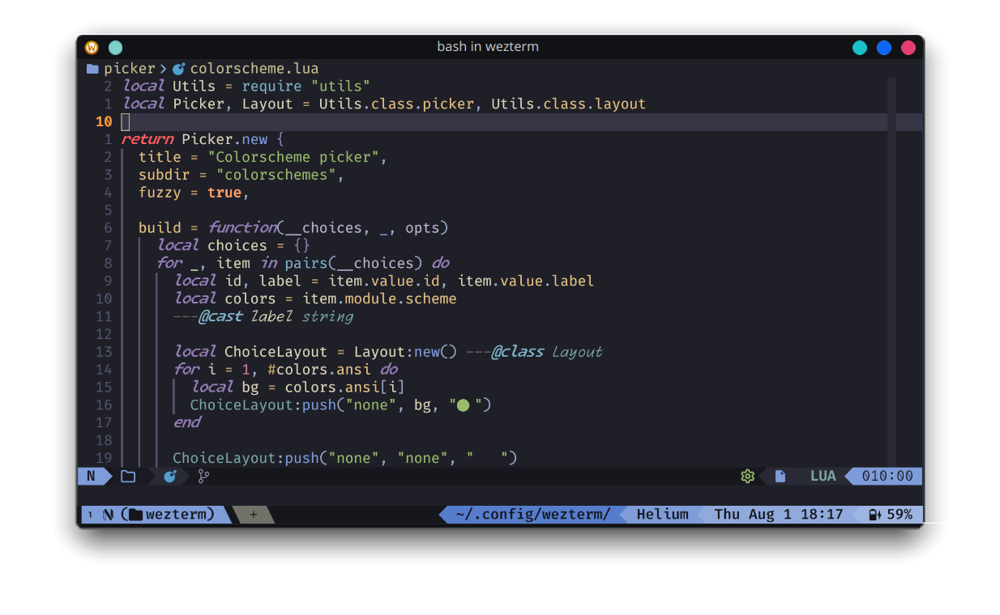

## Installation

> [!NOTE]
>
> Requirements:
>
> - [Wezterm _**nightly**_](https://wezfurlong.org/wezterm/installation.html)
> - [Fira Code NerdFont](https://www.nerdfonts.com).
> - [Monaspace Radon](https://github.com/githubnext/monaspace/releases/latest)
> - [Monaspace Krypton](https://github.com/githubnext/monaspace/releases/latest)

1. **Backup any old config**:

    ~~~sh
    # on Linux
    mv ~/.config/wezterm ~/.config/wezterm.bak
    ~~~

    ~~~powershell
    # on Windows
    Move-Item $env:HOME/.config/wezterm $env:HOME/.config/wezterm.bak
    ~~~

2. **Clone the repo:**

    ~~~sh
    # on Linux
    git clone https://github.com/sravioli/wezterm.git ~/.config/wezterm
    ~~~

    ~~~powershell
    # on Windows
    git clone https://github.com/sravioli/wezterm.git $env:HOME/.config/wezterm
    ~~~

3. **Done** 🎉.

## Features

### Flexible status bar

<https://github.com/user-attachments/assets/d8bd96f1-53d6-4fb0-9771-53ca8ecd604b>

> [!NOTE]
>
> Compare to the stock wezterm status bar
>
> 

The status bar is flexile and responsive.  This ensures that important
information is always visible and/or adapts gracefully to changes in the
terminal size.

The status bar attempts to display the most detailed version of each status
bar element.  If space is insufficient, it falls back to shorter versions or
omits the element entirely.

Elements from Right-to-Left:

1. Battery:
   - icon and percentage
   - percentage only
   - icon only
2. Datetime (using Rust [chrono strftime](https://docs.rs/chrono/0.4.19/chrono/format/strftime/index.html) syntax):
   - `"%a %b %-d %H:%M"` (eg. `Thu Aug 1 19:30`)
   - `"%d/%m %R"` (eg. `01/08 19:30`)
   - `"%R"`  (eg. `19:30`)
3. Hostname:
   - hostname
   - hostname initial only
4. Current working directory (cwd):
   - full cwd
   - cwd with directories shortened at four letters
   - cwd with directories shortened at one letter

### Picker

The picker utility class simplify the use of the builtin
[`wezterm.action.InputSelector`](https://wezfurlong.org/wezterm/config/lua/keyassignment/InputSelector.html).

Creating a new picker is easy, only the two following fields must be specified if
you agree with the default settings.

~~~lua
local Picker = require("utils").class.picker

return Picker.new {
  title = "Font picker",
  subdir = "fonts",
}
~~~

You can otherwise specify every field for more control.  After defining a picker
you should add the choices in the specified subdirectory (eg.
`./picker/assets/<subdir>/<file>.lua`).  The picker expects asset files to
contain these two functions:

~~~lua
---The wezterm window object
---@class wt.Window

---The wezterm Pane object
---@class wt.Pane

---@alias PickList.Opts { window: wt.Window, pane: wt.Pane, id: string|nil, label: string|nil }
---@alias PickList.getReturn string|{ id: string|nil, label: string|table|nil }

---@class PickList
---@field get      fun(): PickList.getReturn
---@field activate fun(Config: table, opts: PickList.Opts): nil
~~~

For more documentation have a look at
[./utils/class/picker.lua](../utils/class/picker.lua)

Currently four picker are already implemented:

1. Colorscheme picker
   

Click for image

   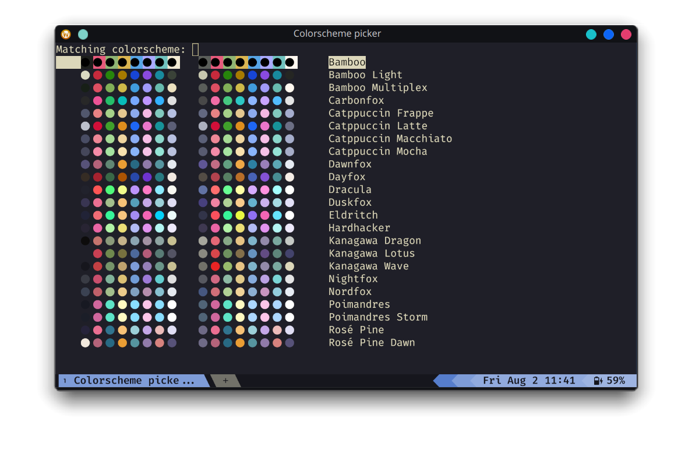
   

2. Font picker
   

Click for image

   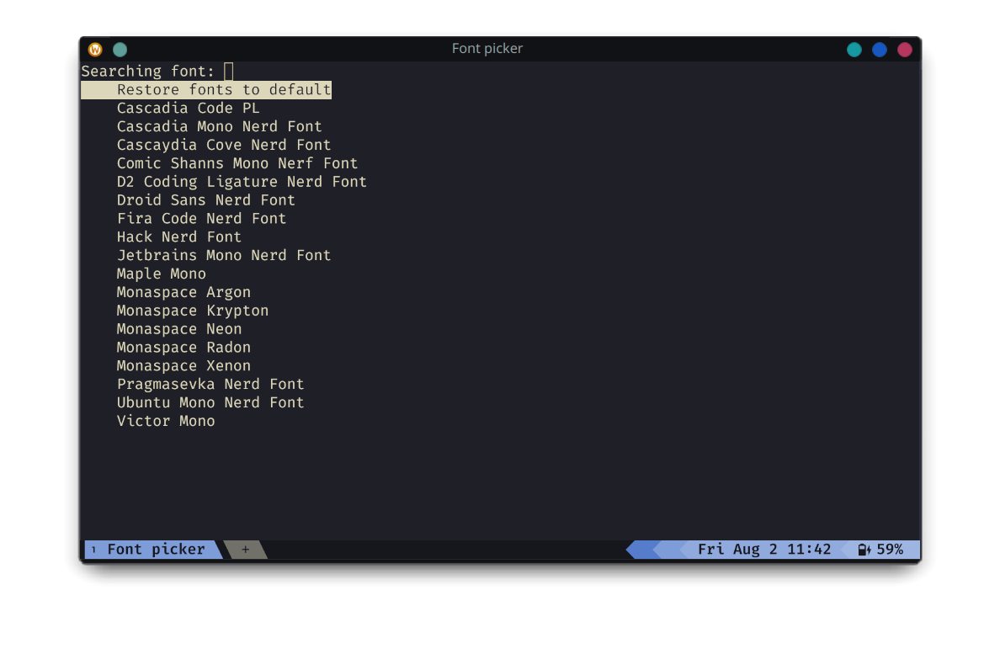
   

3. Font size picker
   

Click for image

   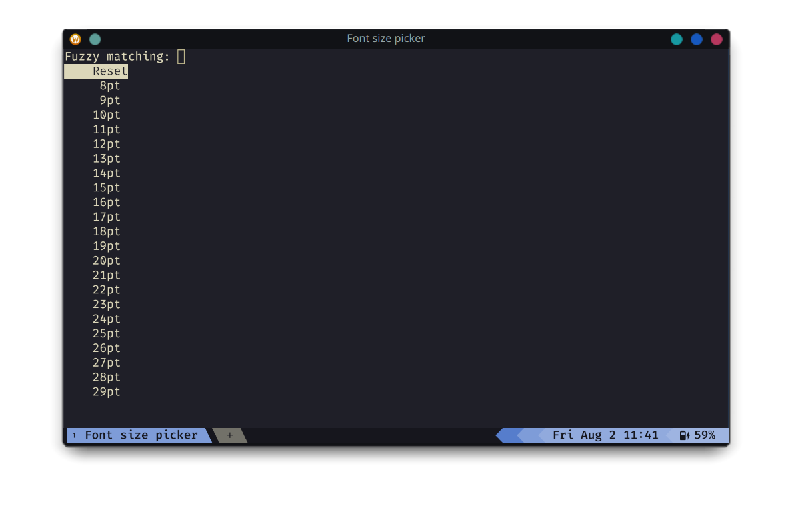
   

4. Font leading picker
   

Click for image

   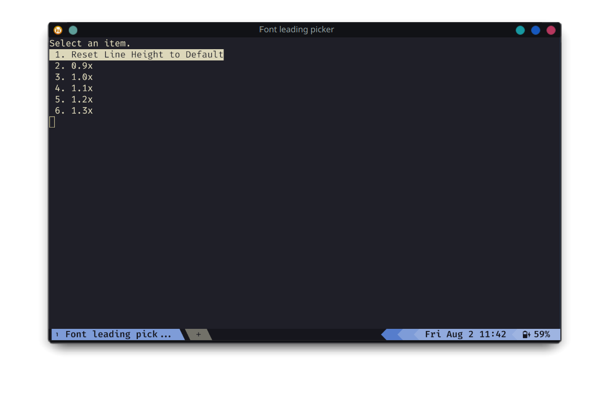
   

Feel free to implement any new picker, [contributions](./contributing.md)
are welcome!

### Mode indicator with modal prompts

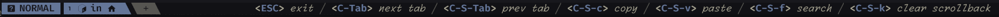

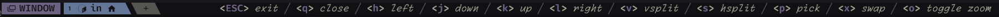

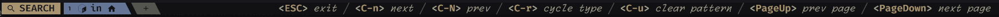

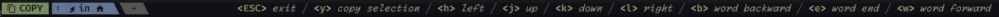

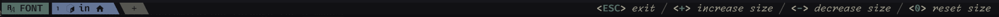

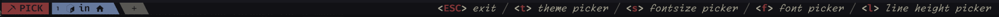

The mode indicator highlights the current operationsl mode of the terminal.
mode is represented by a distinct label and background color, providing a clear
visual cue.  The mode indicator is positioned on the left side of the tab bar.

When a mode is activated, it shows a series of prompts to guide the user on
available commands. Each prompt includes a key and its description, styled
colors and fonts.

As for the status-bar, the prompt length gets calculated to ensure it fits within
the available space, then each prompt is formatted with a key (or list of keys)
enclosed in angle brackets (`<key>`) and followed by its description in
italicized text.

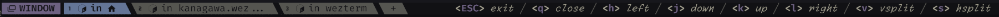

<!--{{{1 MODES KEYMAPS -->

<!-- {{{2 COPY MODE-->

  
<strong>copy-mode</strong>

  | Key       | Action                                   |
  | --------- | ---------------------------------------- |
  | `<ESC>`   | Exit copy mode                           |
  | `<Tab>`   | Jump word forward                        |
  | `<S-Tab>` | Jump word backward                       |
  | `<CR>`    | Jump to start of next line               |
  | `<Space>` | Set selection mode to cell               |
  | `0`       | Jump to start of line                    |
  | `$`       | Jump to end of line content              |
  | `^`       | Jump to start of line content            |
  | `,`       | Jump again backward                      |
  | `;`       | Jump again                               |
  | `F`       | Jump backward (prev char off)            |
  | `f`       | Jump forward (prev char off)             |
  | `T`       | Jump backward (prev char on)             |
  | `t`       | Jump forward (prev char on)              |
  | `G`       | Jump to scrollback bottom                |
  | `g`       | Jump to scrollback top                   |
  | `h`       | Move left                                |
  | `j`       | Move down                                |
  | `k`       | Move up                                  |
  | `l`       | Move right                               |
  | `H`       | Jump to viewport top                     |
  | `L`       | Jump to viewport bottom                  |
  | `M`       | Jump to viewport middle                  |
  | `V`       | Set selection mode to line               |
  | `v`       | Set selection mode to cell               |
  | `<C-v>`   | Set selection mode to block              |
  | `O`       | Jump to selection other end (horizontal) |
  | `o`       | Jump to selection other end              |
  | `b`       | Jump backward word                       |
  | `e`       | Jump forward word end                    |
  | `w`       | Jump forward word                        |
  | `<C-d>`   | Move by page down                        |
  | `<C-u>`   | Move by page up                          |
  | `y`       | Copy selection and exit                  |

<!-- }}}  -->

<!-- {{{2 SEARCH MODE -->

  
<strong>search-mode</strong>

  | Key                   | Action                   |
  | --------------------- | ------------------------ |
  | `<ESC>`               | Exit search mode         |
  | `<CR>`                | Jump to prior match      |
  | `<C-n>`/`<DownArrow>` | Jump to next match       |
  | `<C-N>`/`<UpArrow>`   | Jump to prior match      |
  | `<C-r>`               | Cycle match type         |
  | `<C-u>`               | Clear search pattern     |
  | `<PageUp>`            | Jump to prior match page |
  | `<PageDown>`          | Jump to next match page  |

<!-- }}} -->

<!-- FONT MODE {{{2 -->

  
<strong>font-mode</strong>

  | Key           | Action             |
  | ------------- | ------------------ |
  | `<ESC>`       | Exit font mode     |
  | `+`           | Increase font size |
  | `-`           | Decrease font size |
  | `0`           | Reset font size    |

<!-- }}} -->

<!-- WINDOW MODE {{{2 -->

  
<strong>window-mode</strong>

  | Key               | Action                        |
  | ----------------- | ----------------------------- |
  | `<ESC>`           | Exit window mode              |
  | `p`               | Pick pane                     |
  | `x`               | Swap with active pane         |
  | `q`               | Close current pane            |
  | `o`               | Toggle pane zoom state        |
  | `v`               | Split horizontal              |
  | `s`               | Split vertical                |
  | `h`/`<LeftArrow>` | Activate pane to the left     |
  | `j`/`<DownArrow>` | Activate pane below           |
  | `k`/`<UpArrow>`   | Activate pane above           |
  | `l`/`<RightArrow>`| Activate pane to the right    |
  | `<`               | Adjust pane size to the left  |
  | `>`               | Adjust pane size to the right |
  | `+`               | Adjust pane size upwards      |
  | `-`               | Adjust pane size downwards    |

<!-- }}} -->

<!-- PICK MODE {{{2 -->

  
<strong>pick-mode</strong>

  | Key           | Action              |
  | ------------- | ------------------- |
  | `<ESC>`       | Exit pick mode      |
  | `c`           | colorscheme picker  |
  | `f`           | font picker         |
  | `s`           | font size picker    |
  | `l`           | font leading picker |

<!-- }}} -->
<!--}}}-->

### Vim-style keymaps

The `<leader>` (`LEADER` for wezterm) key is `<C-Space>` (Ctrl + Space).

Key combinations try to follow the same conventions as Vim, with the added
modifier of `W` that maps to the `SUPER`/`WINDOWS` key.

Switching mode is made possibile using designated leader key combinations:
`<leader>w` for window mode, `<leader>f` for font mode, `<leader>c` for copy mode,
`<leader>p` for pick mode and `<leader>s` for search mode.

Additional adjustments and bindings can be effortlessly incorporated to cater to
individual preferences and requirements.  Adding or modifing existing keymaps is
very easy: add (or remove) the desired keymap to the table in
[./mappings/default.lua](../mappings/default.lua). The keymap will be
automatically converted to Wezterm's syntax.

Usage example as follows:

~~~lua
local act = require("wezterm").action
local Config = { keys = {} } ---wezterm config table

require("utils.fn").key.map("<M-CR>", act.ToggleFullScreen, Config.keys)

return Config
~~~

the previous mapping will be translated to:

~~~lua
{ key = "Enter", mods = "ALT", action = act.ToggleFullScreen }
~~~

<!--{{{1 DEFAULT KEYMAPS-->

  
<strong>default keymaps</strong>

  | Key Combination | Action                                    |
  | --------------- |------------------------------------------ |
  | `<C-Tab>`       | Next Tab                                  |
  | `<C-S-Tab>`     | Previous Tab                              |
  | `<M-CR>`        | Toggle Fullscreen                         |
  | `<C-S-c>`       | Copy to Clipboard                         |
  | `<C-S-v>`       | Paste from Clipboard                      |
  | `<C-S-f>`       | Search Current Selection or Empty String  |
  | `<C-S-k>`       | Clear Scrollback Buffer                   |
  | `<C-S-l>`       | Show Debug Overlay                        |
  | `<C-S-n>`       | Spawn New Window                          |
  | `<C-S-p>`       | Activate Command Palette                  |
  | `<C-S-r>`       | Reload Configuration                      |
  | `<C-S-t>`       | Spawn Tab in Current Pane Domain          |
  | `<C-S-u>`       | Character Select (Copy to Clipboard)      |
  | `<C-S-w>`       | Close Current Tab (with confirmation)     |
  | `<C-S-z>`       | Toggle Pane Zoom State                    |
  | `<PageUp>`      | Scroll Up by Page                         |
  | `<PageDown>`    | Scroll Down by Page                       |
  | `<C-S-Insert>`  | Paste from Primary Selection              |
  | `<C-Insert>`    | Copy to Primary Selection                 |
  | `<C-S-Space>`   | Quick Select                              |
  | `<C-S-">`       | Split Horizontal (Current Pane Domain)    |
  | `<C-S-%>`       | Split Vertical (Current Pane Domain)      |
  | `<C-M-h>`       | Activate Pane Direction (Left)            |
  | `<C-M-j>`       | Activate Pane Direction (Down)            |
  | `<C-M-k>`       | Activate Pane Direction (Up)              |
  | `<C-M-l>`       | Activate Pane Direction (Right)           |
  | `<leader>w`     | Activate Window Mode                      |
  | `<leader>f`     | Activate Font Mode                        |
  | `<leader>c`     | Activate Copy Mode                        |
  | `<leader>h`     | Activate Help Mode                        |
  | `<leader>p`     | Activate Pick Mode                        |
  | `<leader>s`     | Search Current Selection or Empty String  |
  | `<S-F1>`        | Activate Tab 1                            |
  | `<S-F2>`        | Activate Tab 2                            |
  | `<S-F3>`        | Activate Tab 3                            |
  | `<S-F4>`        | Activate Tab 4                            |
  | `<S-F5>`        | Activate Tab 5                            |
  | `<S-F6>`        | Activate Tab 6                            |
  | `<S-F7>`        | Activate Tab 7                            |
  | `<S-F8>`        | Activate Tab 8                            |
  | `<S-F9>`        | Activate Tab 9                            |
  | `<S-F10>`       | Activate Tab 10                           |

<!--}}}-->

## Thanks

- [@Wez](https://www.github.com/wez) of course, for the awesome terminal.
- [@apredezdc](https://github.com/aperezdc/) for it's implementation of [lua-wcwidth](https://github.com/aperezdc/lua-wcwidth).
- [@KevinSilvester](https://github.com/KevinSilvester) for his GPU adapter auto picker.
- [@twilsoft](https://github.com/twilsoft) inspired the modal prompts with their [wezmode](https://github.com/twilsoft/wezmode) project.
- [@akthe-at](https://github.com/akthe-at) for his contributions to the project.

<!-- vim: set fdm=marker fdl=1 -->
