# sravioli/wezterm

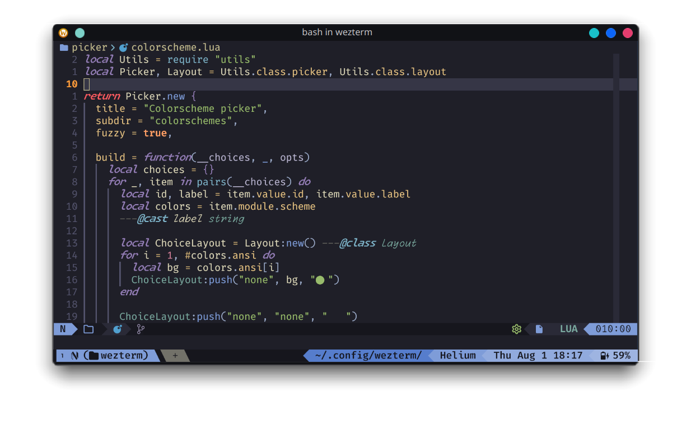

A feature-rich, highly customizable [WezTerm](https://wezfurlong.org/wezterm/)
configuration. Responsive status bar, Vim-style modal keybindings, interactive
pickers, and a powerful override system — all in pure Lua.

## Installation

> [!NOTE]
>
> **Requirements:**
>
> - [WezTerm **nightly**](https://wezfurlong.org/wezterm/installation.html)
> - [Fira Code NerdFont](https://www.nerdfonts.com)
> - [Monaspace Radon](https://github.com/githubnext/monaspace/releases/latest)
>   and [Monaspace Krypton](https://github.com/githubnext/monaspace/releases/latest)

1. **Backup any old config:**

    ~~~sh
    # Linux / macOS
    mv ~/.config/wezterm ~/.config/wezterm.bak
    ~~~

    ~~~powershell
    # Windows (PowerShell)
    Move-Item $env:USERPROFILE/.config/wezterm $env:USERPROFILE/.config/wezterm.bak
    ~~~

2. **Clone the repo:**

    ~~~sh
    # Linux / macOS
    git clone https://github.com/sravioli/wezterm.git ~/.config/wezterm
    ~~~

    ~~~powershell
    # Windows (PowerShell)
    git clone https://github.com/sravioli/wezterm.git "$env:USERPROFILE/.config/wezterm"
    ~~~

3. **Launch WezTerm** and press `Ctrl+Space` then `h` to enter **Help Mode** —
   you'll see all available keybindings at a glance.

> [!TIP]
>
> See the [Platform Setup](https://github.com/sravioli/wezterm/wiki/Platform-Setup)
> wiki page for WSL, SSH, and GPU configuration details.

## Features

### Responsive status bar

https://github.com/user-attachments/assets/d8bd96f1-53d6-4fb0-9771-53ca8ecd604b

The status bar adapts gracefully to terminal width. Each element has multiple
fallback modes — from full detail down to icon-only — ensuring important
information is always visible.

> [!NOTE]
>
> Compare to the stock WezTerm status bar:
>
> 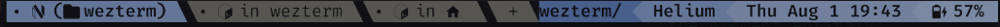

### Modal modes with guided prompts

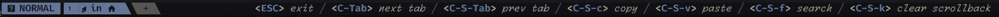

Six operational modes with inline key hints. The leader key is `<C-Space>`.

| Leader combo | Mode | Description |
|-------------|------|-------------|
| `<leader>h` | Help | Reference overlay of all bindings |
| `<leader>w` | Window | Pane splits, navigation, resize |
| `<leader>f` | Font | Adjust font size interactively |
| `<leader>c` | Copy | Vim-style text selection |
| `<leader>s` | Search | Pattern matching and navigation |
| `<leader>p` | Pick | Colorscheme, font, size, leading |

Prompts are responsive — they paginate when the terminal is narrow.

<details>
<summary>See all mode screenshots</summary>

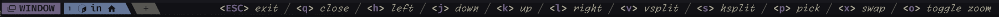
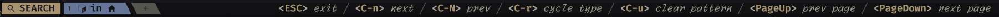
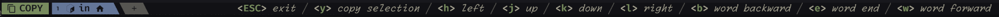
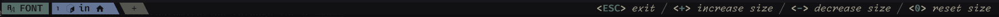
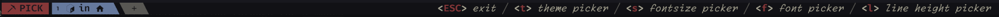
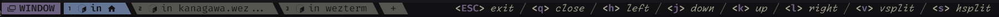

</details>

### Interactive pickers

Four built-in pickers wrapping WezTerm's `InputSelector`:

1. **Colorscheme** — 30+ themes with inline palette preview
2. **Font** — 19 NerdFont families
3. **Font size** — Preset sizes
4. **Font leading** — Line spacing presets

<details>
<summary>See picker screenshots</summary>

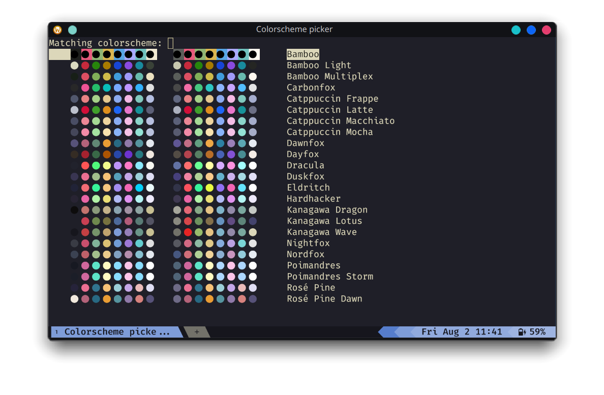
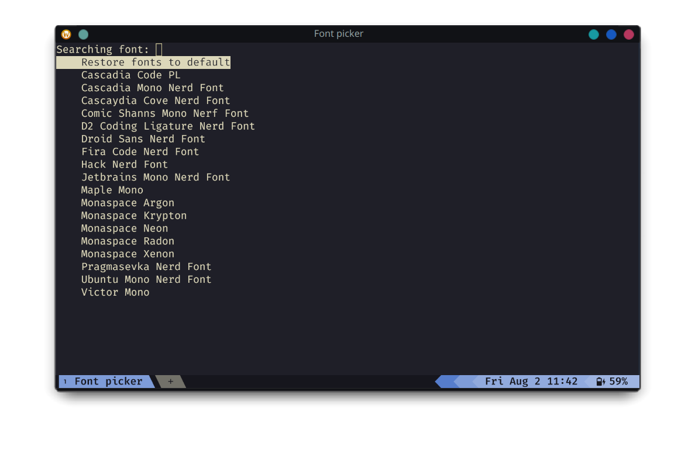
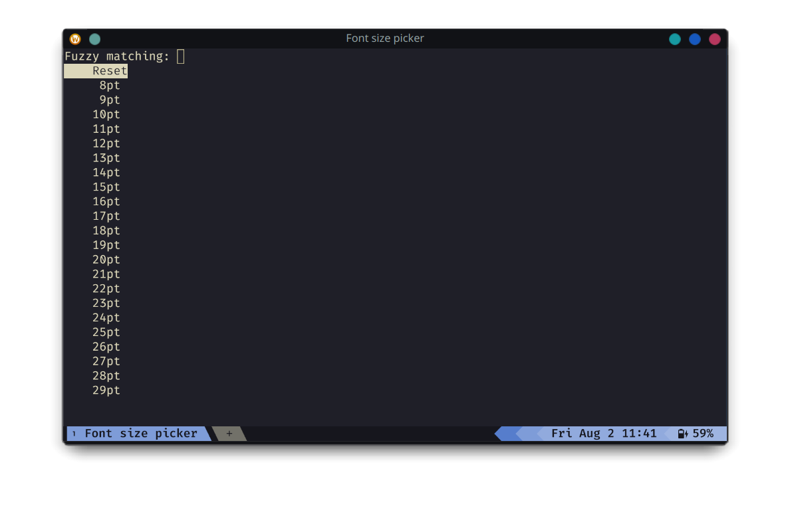
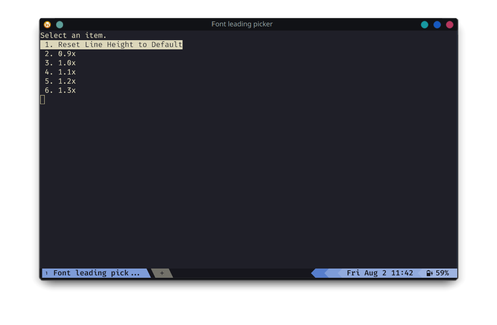

</details>

### Vim-style keybindings

50+ keybindings using Vim notation, auto-translated to WezTerm's native format.
All customizable in `mappings/default.lua`.

```lua
-- Vim syntax is automatically translated:
"<C-S-a>"     -->  { key = "a", mods = "CTRL|SHIFT" }
"<leader>w"   -->  { key = "w", mods = "LEADER" }
"<M-CR>"      -->  { key = "Enter", mods = "ALT" }
```

## Learn more

| Page | Description |
|------|-------------|
| **[Keybindings](https://github.com/sravioli/wezterm/wiki/Keybindings)** | All modal tables and default keymaps |
| **[Architecture](https://github.com/sravioli/wezterm/wiki/Architecture)** | Project structure, load order, design patterns |
| **[Customization](https://github.com/sravioli/wezterm/wiki/Customization)** | Override system, custom pickers, themes, keybindings |
| **[Recipes](https://github.com/sravioli/wezterm/wiki/Recipes)** | Practical examples and tips |
| **[Troubleshooting](https://github.com/sravioli/wezterm/wiki/Troubleshooting)** | FAQ and common issues |
| **[Platform Setup](https://github.com/sravioli/wezterm/wiki/Platform-Setup)** | Windows, Linux, macOS specifics |
| **[Contributing](https://github.com/sravioli/wezterm/wiki/Contributing)** | How to contribute |

## Thanks

- [@Wez](https://www.github.com/wez) for the awesome terminal.
- [@aperezdc](https://github.com/aperezdc/) for [lua-wcwidth](https://github.com/aperezdc/lua-wcwidth).
- [@KevinSilvester](https://github.com/KevinSilvester) for the GPU adapter auto picker.
- [@twilsoft](https://github.com/twilsoft) for inspiring the modal prompts with [wezmode](https://github.com/twilsoft/wezmode).
- [@akthe-at](https://github.com/akthe-at) for contributions to the project.
