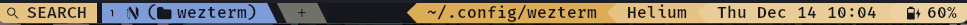
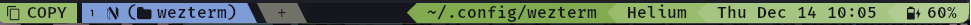
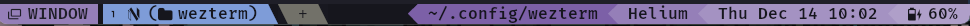
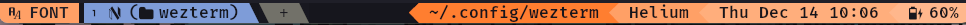

# My wezterm configuration

<!--toc:start-->
- [My wezterm configuration](#my-wezterm-configuration)
  - [Features](#features)
    - [Mode indicator](#mode-indicator)
    - [Vim-style keymaps](#vim-style-keymaps)
    - [Flexible status-bar](#flexible-status-bar)
<!--toc:end-->

## Features

### Mode indicator

Four mode are currenty supported:

Search, copy and window mode have vim-like mappings.

Each mode also changes the status-bar colors! ([can be easily disabled](https://github.com/sravioli/wezterm/blob/main/events/update-status.lua#L28))

### Vim-style keymaps

Mappings are defined using vim-like syntax, with the added `W` modifier that
maps to the `SUPER`/`WINDOWS` key.

Usage example as follows:

~~~lua
local act = require("wezterm").action
local Config = { keys = {} } ---the wezterm config table

require("utils.fun").map("<M-CR>", act.ToggleFullScreen, Config.keys)

return Config
~~~

the previous mapping will be translated to:

~~~lua
{
  key = "Enter",
  mods = "ALT",
  action = act.ToggleFullScreen
}
~~~

I find it easier to just use a loop:

~~~lua
local fun = require("utils.fun")

local keys = {
  ["<leader>\\"] = act.SendKey { key = "\\" }, ---send key on <leader><leader>
  ["<C-Tab>"] = act.ActivateTabRelative(1),
  ["<C-S-Tab>"] = act.ActivateTabRelative(-1),
  ["<M-CR>"] = act.ToggleFullScreen,
  ["<C-S-c>"] = act.CopyTo "Clipboard",
  ["<C-S-v>"] = act.PasteFrom "Clipboard",
  ["<C-S-f>"] = act.Search "CurrentSelectionOrEmptyString",
  ["<C-S-k>"] = act.ClearScrollback "ScrollbackOnly",
  -- ...
}

Config.keys = {}
for lhs, rhs in pairs(keys) do
  fun.map(lhs, rhs, Config.keys)
end
~~~

Don't forget to set a `LEADER`!

For the full mappings list take a look at
[./mappings/default.lua](./mappings/default.lua) and
[./mappings/modes.lua](./mappings/modes.lua).

### Flexible status-bar

https://github.com/sravioli/wezterm/assets/76562615/59785192-34b3-4e57-9804-cf2e64225887

The status bar will give priority to the tab bar. During the status bar evaluation
the available width is calculated and elements are not rendered to gracefully
truncate the status-bar.

The width is calculated using <https://github.com/aperezdc/lua-wcwidth> and some
other things, for more info take a look at [./events/update-status.lua](./events/update-status.lua)

Currenty trying to figure out how to add fallback for each cell, i.e. if there
isn't enough space to render the full cell, fallback to a shorter one, if the
space is still not enough, hide the cell, for example:

~~~text
      [try]       too long?  [try]  too long?
2023-12-14 11:05 ----------> 11:06 ----------> ""
~~~

### Multiple fonts

The base font is Fira Code NF. Monaspace Radon is used for italics and Monaspace
Krypton is used for bold-italics.
