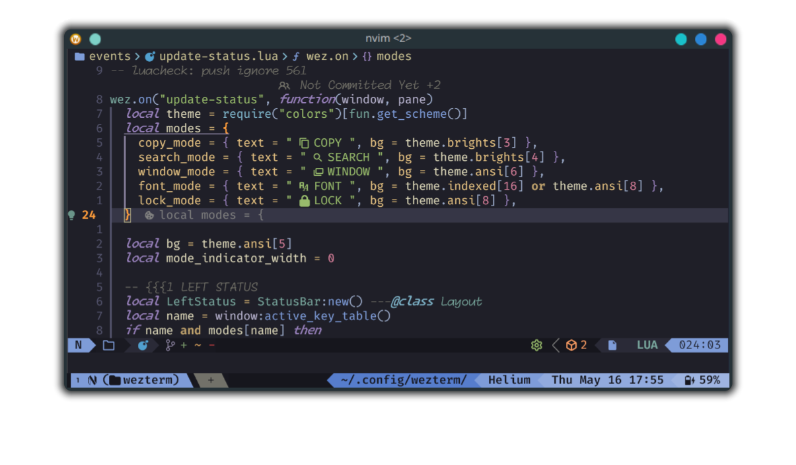
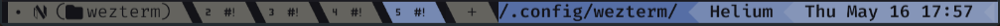
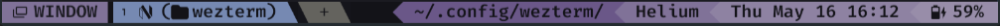
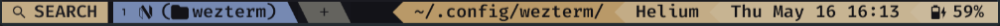
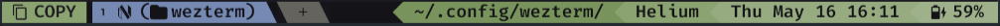
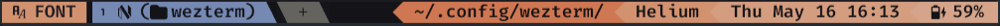

# My wezterm config

## Features

### Flexible status-bar

<https://github.com/sravioli/wezterm/assets/76562615/990e099d-c933-4f45-89f6-503135341fb9>

This configuration provides a flexible and responsive status bar for WezTerm,
ensuring important information is always visible and adapts gracefully to changes
in terminal size.

The configuration attempts to display the most detailed version of each
status-bar element.  If space is insufficient, it falls back to shorter versions
or omits the element entirely.  It shows the full path, a shortened path, or an
abbreviated path for the current working directory (CWD). For the hostname, it
displays the full hostname or its first letter if space is limited. Date and time
are shown in various formats: full date and time, date in dd/mm format, or
only the time. The battery status is represented by the full battery status with
icon and percentage, percentage only, or icon only.

Compare to stock Wezterm:

### Mode indicator

The mode indicator highlights the current operational mode of the terminal, such
as copy mode, search mode, window mode or font mode.  Each mode is represented by
a distinct label and background color, providing a clear visual cue.  The mode
indicator is positioned on the left side of the status-bar.

The mode indicator supports customization through the [`modes`
table](./events/update-status.lua), which defines the text label and background
color for each mode.  The configuration listens for changes in the active key
table and updates the mode indicator accordingly. This feature provides
immediate feedback on the terminal's operational state.

Search, window and copy mode feature vim-like keymaps.

<!--{{{1 MODES KEYMAPS -->

  
<strong>copy-mode</strong>

  | Key           | Action                                   |
  | ------------- | ---------------------------------------- |
  | `<ESC>`/`<q>` | Exit copy mode                           |
  | `<Tab>`       | Jump word forward                        |
  | `<S-Tab>`     | Jump word backward                       |
  | `<CR>`        | Jump to start of next line               |
  | `<Space>`     | Set selection mode to cell               |
  | `0`           | Jump to start of line                    |
  | `$`           | Jump to end of line content              |
  | `^`           | Jump to start of line content            |
  | `,`           | Jump again backward                      |
  | `;`           | Jump again                               |
  | `F`           | Jump backward (prev char off)            |
  | `f`           | Jump forward (prev char off)             |
  | `T`           | Jump backward (prev char on)             |
  | `t`           | Jump forward (prev char on)              |
  | `G`           | Jump to scrollback bottom                |
  | `g`           | Jump to scrollback top                   |
  | `h`           | Move left                                |
  | `j`           | Move down                                |
  | `k`           | Move up                                  |
  | `l`           | Move right                               |
  | `H`           | Jump to viewport top                     |
  | `L`           | Jump to viewport bottom                  |
  | `M`           | Jump to viewport middle                  |
  | `V`           | Set selection mode to line               |
  | `v`           | Set selection mode to cell               |
  | `<C-v>`       | Set selection mode to block              |
  | `O`           | Jump to selection other end (horizontal) |
  | `o`           | Jump to selection other end              |
  | `b`           | Jump backward word                       |
  | `e`           | Jump forward word end                    |
  | `w`           | Jump forward word                        |
  | `<C-d>`       | Move by page down                        |
  | `<C-u>`       | Move by page up                          |
  | `y`           | Copy selection and exit                  |

  
<strong>search-mode</strong>

  | Key           | Action                   |
  | ------------- | ------------------------ |
  | `<ESC>`/`<q>` | Exit search mode         |
  | `<CR>`        | Jump to prior match      |
  | `<C-n>`       | Jump to next match       |
  | `<C-N>`       | Jump to prior match      |
  | `<C-r>`       | Cycle match type         |
  | `<C-u>`       | Clear search pattern     |
  | `<PageUp>`    | Jump to prior match page |
  | `<PageDown>`  | Jump to next match page  |
  | `<UpArrow>`   | Jump to prior match      |
  | `<DownArrow>` | Jump to next match       |

  
<strong>font-mode</strong>

  | Key           | Action             |
  | ------------- | ------------------ |
  | `<ESC>`/`<q>` | Exit font mode     |
  | `+`           | Increase font size |
  | `-`           | Decrease font size |
  | `0`           | Reset font size    |

  
<strong>window-mode</strong>

  | Key           | Action                        |
  | --------------| ----------------------------- |
  | `<ESC>`/`<q>` | Exit window mode              |
  | `p`           | Pick pane                     |
  | `x`           | Swap with active pane         |
  | `q`           | Close current pane            |
  | `o`           | Toggle pane zoom state        |
  | `v`           | Split horizontal              |
  | `s`           | Split vertical                |
  | `<LeftArrow>` | Activate pane to the left     |
  | `<DownArrow>` | Activate pane below           |
  | `<UpArrow>`   | Activate pane above           |
  | `<RightArrow>`| Activate pane to the right    |
  | `h`           | Activate pane to the left     |
  | `j`           | Activate pane below           |
  | `k`           | Activate pane above           |
  | `l`           | Activate pane to the right    |
  | `<`           | Adjust pane size to the left  |
  | `<S->>`       | Adjust pane size to the right |
  | `+`           | Adjust pane size upwards      |
  | `-`           | Adjust pane size downwards    |

<!--}}}-->

### Vim-style keymaps

The config defines custom key bindings, inspired by Vim's keymap system.

The `<leader>` (`LEADER` for wezterm) key is `<M-\>` (Alt + Backspace).

The key bindings are defined using Vim syntax, allowing users to leverage their
familiarity with Vim's intuitive keymap system.  Key combinations try to follow
the same conventions as Vim, with the added modifier of `W` that maps to the
`SUPER`/`WINDOWS` key.

Switching mode is made possibile using designated leader key combinations:
`<leader>w` for window mode, `<leader>f` for font mode, `<leader>c` for copy mode
and `<leader>s` for search mode.

Additional adjustments and bindings can be effortlessly incorporated to cater to
individual preferences and requirements.  Adding or modifing existing keymaps is
very easy: add (or remove) the desired keymap to the table in
[./mappings/default.lua](./mappings/default.lua). The keymap will be
automatically converted to Wezterm's syntax.

Usage example as follows:

~~~lua
local act = require("wezterm").action
local Config = { keys = {} } ---the wezterm config table

require("utils.fun").map("<M-CR>", act.ToggleFullScreen, Config.keys)

return Config
~~~

the previous mapping will be translated to:

~~~lua
{ key = "Enter", mods = "ALT", action = act.ToggleFullScreen } 
~~~

<!--{{{1 DEFAULT KEYMAPS-->

  
<strong>default keymaps</strong>

  | Key Combination | Action                                   |
  |-----------------|------------------------------------------|
  | `<C-Tab>`       | Next Tab                                  |
  | `<C-S-Tab>`     | Previous Tab                              |
  | `<M-CR>`        | Toggle Fullscreen                         |
  | `<C-S-c>`       | Copy to Clipboard                         |
  | `<C-S-v>`       | Paste from Clipboard                      |
  | `<C-S-f>`       | Search Current Selection or Empty String  |
  | `<C-S-k>`       | Clear Scrollback Buffer                   |
  | `<C-S-l>`       | Show Debug Overlay                        |
  | `<C-S-n>`       | Spawn New Window                          |
  | `<C-S-p>`       | Activate Command Palette                  |
  | `<C-S-r>`       | Reload Configuration                      |
  | `<C-S-t>`       | Spawn Tab in Current Pane Domain          |
  | `<C-S-u>`       | Character Select (Copy to Clipboard)      |
  | `<C-S-w>`       | Close Current Tab (with confirmation)     |
  | `<C-S-z>`       | Toggle Pane Zoom State                    |
  | `<PageUp>`      | Scroll Up by Page                         |
  | `<PageDown>`    | Scroll Down by Page                       |
  | `<C-S-Insert>`  | Paste from Primary Selection              |
  | `<C-Insert>`    | Copy to Primary Selection                 |
  | `<C-S-Space>`   | Quick Select                              |
  | `<C-S-">`       | Split Horizontal (Current Pane Domain)    |
  | `<C-S-%>`       | Split Vertical (Current Pane Domain)      |
  | `<C-M-h>`       | Activate Pane Direction (Left)            |
  | `<C-M-j>`       | Activate Pane Direction (Down)            |
  | `<C-M-k>`       | Activate Pane Direction (Up)              |
  | `<C-M-l>`       | Activate Pane Direction (Right)           |
  | `<leader>w`     | Activate Window Mode                      |
  | `<leader>f`     | Activate Font Mode                        |
  | `<C-g>`         | Activate Lock Mode                        |
  | `<leader>c`     | Activate Copy Mode                        |
  | `<leader>s`     | Search Current Selection or Empty String  |
  | `<S-F1>`        | Activate Tab 1                            |
  | `<S-F2>`        | Activate Tab 2                            |
  | `<S-F3>`        | Activate Tab 3                            |
  | `<S-F4>`        | Activate Tab 4                            |
  | `<S-F5>`        | Activate Tab 5                            |
  | `<S-F6>`        | Activate Tab 6                            |
  | `<S-F7>`        | Activate Tab 7                            |
  | `<S-F8>`        | Activate Tab 8                            |
  | `<S-F9>`        | Activate Tab 9                            |
  | `<S-F10>`       | Activate Tab 10                           |

<!--}}}-->

### Multiple fonts

The base font is [Fira Code
NerdFont](https://www.nerdfonts.com).
[Monaspace Radon](https://github.com/githubnext/monaspace/releases/latest) is
used for italics and [Monaspace
Krypton](https://github.com/githubnext/monaspace/releases/latest) is used for
bold-italics.

### Thanks

Special thanks to [@Wez](https://www.github.com/wez) (of course) and to
[@apredezdc](https://github.com/aperezdc/) for
[lua-wcwidth](https://github.com/aperezdc/lua-wcwidth)
